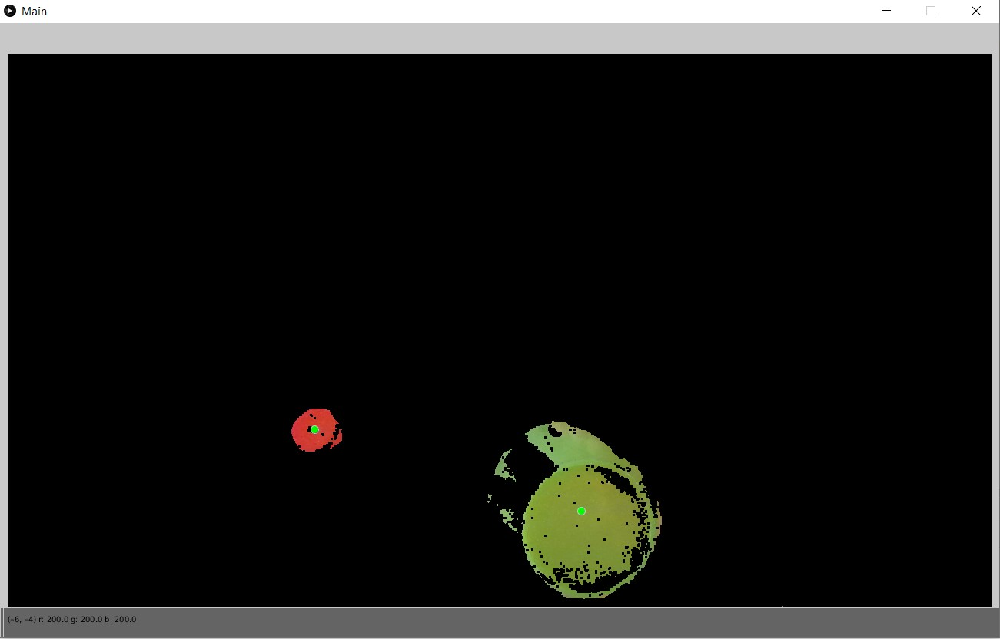

# Object_Tracker
- Uses a box blur convolution matrix and a color threshold to filter out the colored objects
- Uses a K-means Clustering algorithm to then track the centers of the colored objects

Webcam framework made by David Dobervich NOT included
